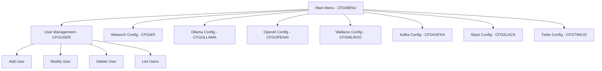

# DBSDK Configuration Administration Application

## Overview
This is a 5250 screen-based administration application for managing the DBSDK_V1 configuration system. The application provides a menu-driven interface for administrators to manage user configurations across multiple AI/integration services.

## Architecture

### Security Model
- **Administrator-Only Access**: Only authorized administrators can run this application
- **Full User Management**: Administrators can view and modify configurations for all users
- **RCAC Bypass**: The application uses `*OWNER` authority to bypass row-level access control for administrative purposes

### Application Structure



## Components

### Display Files (DSPF)
All display files will be stored in IFS and compiled to DBSDK_V1 library:

1. **CFGMENUD** - Main menu display file
2. **CFGUSERD** - User management display file
3. **CFGWXD** - WatsonX configuration display file
4. **CFGOLLAMD** - Ollama configuration display file
5. **CFGOPENAID** - OpenAI Compatible configuration display file
6. **CFGWLROOD** - Wallaroo configuration display file
7. **CFGKAFKAD** - Kafka configuration display file
8. **CFGSLACKD** - Slack configuration display file
9. **CFGTWILIOD** - Twilio configuration display file

### RPGLE Programs
All programs will be stored in IFS and compiled to DBSDK_V1 library:

1. **CFGMENU** - Main menu controller
2. **CFGUSER** - User management program
3. **CFGWX** - WatsonX configuration program
4. **CFGOLLAMA** - Ollama configuration program
5. **CFGOPENAI** - OpenAI Compatible configuration program
6. **CFGWLROO** - Wallaroo configuration program
7. **CFGKAFKA** - Kafka configuration program
8. **CFGSLACK** - Slack configuration program
9. **CFGTWILIO** - Twilio configuration program

### SQL Procedures
Additional SQL procedures for configuration management:

1. **CONF_GET_USER** - Retrieve user configuration
2. **CONF_UPDATE_USER** - Update user configuration
3. **CONF_LIST_USERS** - List all users in configuration table

## Database Schema

### Table: DBSDK_V1.CONF
Primary configuration table with the following fields:

**User Identification:**
- USRPRF (VARCHAR(10)) - Primary Key

**WatsonX Configuration:**
- watsonx_region (VARCHAR(16))
- watsonx_apiVersion (VARCHAR(10))
- watsonx_apikey (VARCHAR(100))
- watsonx_projectid (VARCHAR(100))

**Ollama Configuration:**
- ollama_protocol (VARCHAR(16))
- ollama_server (VARCHAR(1000))
- ollama_port (INT)
- ollama_model (VARCHAR(1000))

**OpenAI Compatible Configuration:**
- openai_compatible_protocol (VARCHAR(16))
- openai_compatible_server (VARCHAR(1000))
- openai_compatible_port (INT)
- openai_compatible_model (VARCHAR(1000))
- openai_compatible_apikey (VARCHAR(8000))
- openai_compatible_basepath (VARCHAR(1000))

**Wallaroo Configuration:**
- wallaroo_tokenurl (VARCHAR(1000))
- wallaroo_confidential_client (VARCHAR(1000))
- wallaroo_confidential_client_secret (VARCHAR(8000))

**Kafka Configuration:**
- kafka_protocol (VARCHAR(16))
- kafka_broker (VARCHAR(1000))
- kafka_port (INT)
- kafka_topic (VARCHAR(1000))

**Slack Configuration:**
- slack_webhook (VARCHAR(1000))

**Twilio Configuration:**
- twilio_number (VARCHAR(1000))
- twilio_sid (VARCHAR(1000))
- twilio_authtoken (VARCHAR(1000))

## Screen Layouts

### Main Menu (CFGMENU)
```
┌─────────────────────────────────────────────────────────────────────────────┐
│                    DBSDK Configuration Administration                       │
│                                                                             │
│  Select an option:                                                          │
│                                                                             │
│    1. User Management                                                       │
│    2. WatsonX Configuration                                                 │
│    3. Ollama Configuration                                                  │
│    4. OpenAI Compatible Configuration                                       │
│    5. Wallaroo Configuration                                                │
│    6. Kafka Configuration                                                   │
│    7. Slack Configuration                                                   │
│    8. Twilio Configuration                                                  │
│                                                                             │
│   90. Exit                                                                  │
│                                                                             │
│  Selection: __                                                              │
│                                                                             │
│  F3=Exit                                                                    │
└─────────────────────────────────────────────────────────────────────────────┘
```

### User Management Screen (CFGUSER)
```
┌─────────────────────────────────────────────────────────────────────────────┐
│                         User Management                                     │
│                                                                             │
│  Action: _  (1=Add, 2=Change, 4=Delete, 5=Display)                         │
│  User Profile: __________                                                   │
│                                                                             │
│  Current Users:                                                             │
│  ┌───────────────────────────────────────────────────────────────────────┐ │
│  │ Sel  User Profile  Last Modified                                      │ │
│  │ _    USER001       2026-03-20 10:30:00                                │ │
│  │ _    USER002       2026-03-21 14:15:00                                │ │
│  │ _    USER003       2026-03-22 09:00:00                                │ │
│  └───────────────────────────────────────────────────────────────────────┘ │
│                                                                             │
│  F3=Exit  F5=Refresh  F12=Cancel                                            │
└─────────────────────────────────────────────────────────────────────────────┘
```

### Service Configuration Screens
Each service configuration screen follows a similar pattern:
- Display current user profile being edited
- Input fields for all service-specific configuration parameters
- Default values displayed
- Field validation
- Save/Cancel options

## Compilation Process

### Display Files
Display files must be copied from IFS to a source physical file before compilation:

```bash
# Create source physical file if needed
CRTSRCPF FILE(QTEMP/QDDSSRC) RCDLEN(112)

# Copy from IFS to source member
CPYFRMSTMF FROMSTMF('/path/to/CFGMENUD.dspf') +
            TOMBR('/QSYS.LIB/QTEMP.LIB/QDDSSRC.FILE/CFGMENUD.MBR') +
            MBROPT(*REPLACE)

# Compile display file
CRTDSPF FILE(DBSDK_V1/CFGMENUD) +
        SRCFILE(QTEMP/QDDSSRC) +
        SRCMBR(CFGMENUD)
```

### RPGLE Programs
RPGLE programs can be compiled directly from IFS:

```bash
CRTBNDRPG PGM(DBSDK_V1/CFGMENU) +
          SRCSTMF('/path/to/CFGMENU.rpgle') +
          DBGVIEW(*SOURCE) +
          OPTION(*EVENTF) +
          USRPRF(*OWNER)
```

### SQL Procedures
SQL procedures are created using RUNSQLSTM:

```bash
RUNSQLSTM SRCSTMF('/path/to/conf_admin.sql') +
          COMMIT(*NONE) +
          ERRLVL(21)
```

## File Naming Conventions

### IFS Source Files
- Display files: `*.dspf` (e.g., `CFGMENUD.dspf`)
- RPGLE programs: `*.rpgle` (e.g., `CFGMENU.rpgle`)
- SQL scripts: `*.sql` (e.g., `conf_admin.sql`)

### Compiled Objects
- Display files: 8-character names ending in 'D' (e.g., `CFGMENUD`)
- Programs: 8-character names (e.g., `CFGMENU`)
- SQL procedures: Descriptive names with underscores (e.g., `CONF_GET_USER`)

## Build Order

1. Create SQL procedures first (dependencies for programs)
2. Compile display files (required by RPGLE programs)
3. Compile RPGLE programs in order:
   - Service-specific programs first
   - Main menu program last

## Usage

### Starting the Application
```
CALL PGM(DBSDK_V1/CFGMENU)
```

### Administrator Setup
The administrator running this application must:
1. Have authority to the DBSDK_V1 library
2. Have authority to read/write the DBSDK_V1.CONF table
3. Be authorized to adopt the program owner's authority (*OWNER)

## Error Handling

All programs include:
- SQL error checking with SQLSTATE
- User-friendly error messages
- Rollback capability for failed updates
- Audit logging of configuration changes

## Future Enhancements

Potential improvements:
1. Add audit trail table for configuration changes
2. Export/import configuration functionality
3. Batch user creation from CSV
4. Configuration validation rules
5. Online help screens (F1 key)
6. Search/filter capabilities in user list