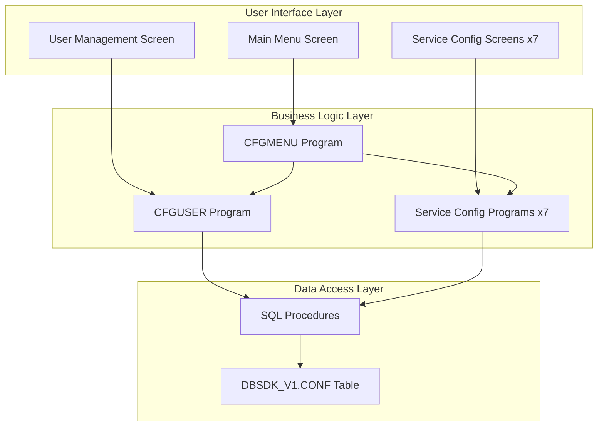

# DBSDK Configuration Administration - Plan Summary

## Executive Summary

This plan outlines the creation of a comprehensive 5250 screen-based administration application for managing the DBSDK_V1 configuration system. The application will provide administrators with a menu-driven interface to manage user configurations across 7 different AI and integration services.

## Project Scope

### What Will Be Created

1. **9 Display Files (DSPF)** - 5250 screen definitions
2. **9 RPGLE Programs** - Business logic and screen controllers
3. **1 SQL Script** - Administrative stored procedures
4. **1 Build Script** - Automated compilation
5. **3 Documentation Files** - Architecture, implementation, and user guides

### Services Covered

1. WatsonX AI
2. Ollama
3. OpenAI Compatible
4. Wallaroo
5. Kafka
6. Slack
7. Twilio

## Architecture Overview



## Key Design Decisions

### 1. Security Model
- **Administrator-Only Access**: Programs use `USRPRF(*OWNER)` to bypass RCAC
- **Full User Management**: Admins can manage all users' configurations
- **Password Protection**: Sensitive fields (API keys, tokens) are password-protected

### 2. User Interface
- **Menu-Driven**: Hierarchical menu structure for easy navigation
- **Separate Screens**: Each service has its own dedicated configuration screen
- **Standard Function Keys**: F3=Exit, F5=Refresh, F12=Cancel

### 3. Data Management
- **Direct Database Access**: Programs update DBSDK_V1.CONF table directly
- **SQL Procedures**: Encapsulate complex database operations
- **Transaction Control**: Proper commit/rollback handling

### 4. Source Management
- **IFS-Based**: All source files stored in IFS
- **Organized Structure**: Separate directories for display files, programs, and SQL
- **Version Control Ready**: Structure supports Git integration

## Implementation Phases

### Phase 1: Foundation (SQL & Display Files)
**Status**: Planned
**Components**:
- SQL administrative procedures
- All 9 display file definitions

**Deliverables**:
- `sql/conf_admin.sql` - SQL procedures
- `dspf/*.dspf` - All display files

### Phase 2: Core Programs (Menu & User Management)
**Status**: Planned
**Components**:
- Main menu program
- User management program

**Deliverables**:
- `rpgle/CFGMENU.rpgle` - Main menu controller
- `rpgle/CFGUSER.rpgle` - User management

### Phase 3: Service Configuration Programs
**Status**: Planned
**Components**:
- 7 service-specific configuration programs

**Deliverables**:
- `rpgle/CFGWX.rpgle` - WatsonX
- `rpgle/CFGOLLAMA.rpgle` - Ollama
- `rpgle/CFGOPENAI.rpgle` - OpenAI
- `rpgle/CFGWLROO.rpgle` - Wallaroo
- `rpgle/CFGKAFKA.rpgle` - Kafka
- `rpgle/CFGSLACK.rpgle` - Slack
- `rpgle/CFGTWILIO.rpgle` - Twilio

### Phase 4: Build Automation & Testing
**Status**: Planned
**Components**:
- Build script
- Testing procedures

**Deliverables**:
- `build.sh` - Automated build script
- Test cases and validation

## File Organization

```
src/admin/
├── README.md                      # User guide (CREATED)
├── DESIGN.md                      # Architecture doc (CREATED)
├── IMPLEMENTATION_PLAN.md         # Technical details (CREATED)
├── PLAN_SUMMARY.md               # This file (CREATED)
├── build.sh                       # Build script (TO CREATE)
│
├── dspf/                          # Display files (TO CREATE)
│   ├── CFGMENUD.dspf             # Main menu
│   ├── CFGUSERD.dspf             # User management
│   ├── CFGWXD.dspf               # WatsonX
│   ├── CFGOLLAMD.dspf            # Ollama
│   ├── CFGOPENAID.dspf           # OpenAI
│   ├── CFGWLROOD.dspf            # Wallaroo
│   ├── CFGKAFKAD.dspf            # Kafka
│   ├── CFGSLACKD.dspf            # Slack
│   └── CFGTWILIOD.dspf           # Twilio
│
├── rpgle/                         # RPGLE programs (TO CREATE)
│   ├── CFGMENU.rpgle             # Main menu
│   ├── CFGUSER.rpgle             # User management
│   ├── CFGWX.rpgle               # WatsonX
│   ├── CFGOLLAMA.rpgle           # Ollama
│   ├── CFGOPENAI.rpgle           # OpenAI
│   ├── CFGWLROO.rpgle            # Wallaroo
│   ├── CFGKAFKA.rpgle            # Kafka
│   ├── CFGSLACK.rpgle            # Slack
│   └── CFGTWILIO.rpgle           # Twilio
│
└── sql/                           # SQL procedures (TO CREATE)
    └── conf_admin.sql            # Admin procedures
```

## Compilation Strategy

### Display Files
Display files require a two-step process:
1. Copy from IFS to source physical file member
2. Compile using CRTDSPF command

**Reason**: IBM i display file compiler requires source in a physical file

### RPGLE Programs
Programs compile directly from IFS:
- Use CRTBNDRPG with SRCSTMF parameter
- Set USRPRF(*OWNER) for administrative access
- Enable debugging with DBGVIEW(*SOURCE)

### SQL Procedures
SQL procedures use RUNSQLSTM:
- Execute directly from IFS
- Set COMMIT(*NONE) for immediate effect
- Handle errors with ERRLVL parameter

## Database Schema

### DBSDK_V1.CONF Table Structure

**Primary Key**: USRPRF (VARCHAR(10))

**Configuration Groups**:
1. **WatsonX** (4 fields): region, apiVersion, apikey, projectid
2. **Ollama** (4 fields): protocol, server, port, model
3. **OpenAI** (6 fields): protocol, server, port, model, apikey, basepath
4. **Wallaroo** (3 fields): tokenurl, client, secret
5. **Kafka** (4 fields): protocol, broker, port, topic
6. **Slack** (1 field): webhook
7. **Twilio** (3 fields): number, sid, authtoken

**Total**: 25 configuration fields per user

## Testing Strategy

### Unit Testing
- Test each display file independently
- Validate field-level edits and validations
- Test each program with valid/invalid inputs
- Verify SQL procedures with various scenarios

### Integration Testing
- Test complete user workflow: Add → Configure → Verify
- Test navigation between all screens
- Test error handling and rollback scenarios
- Verify RCAC bypass works correctly

### User Acceptance Testing
- Administrator performs typical tasks
- Verify configurations save correctly
- Test with multiple concurrent users
- Validate security and authority model

## Success Criteria

The project will be considered successful when:

1. ✅ All source files are created and documented
2. ✅ All components compile without errors
3. ✅ Application runs and displays main menu
4. ✅ User management functions work correctly
5. ✅ All 7 service configuration screens function properly
6. ✅ Data saves correctly to DBSDK_V1.CONF table
7. ✅ Administrator can manage all users' configurations
8. ✅ Build script automates compilation process
9. ✅ Documentation is complete and accurate

## Risk Assessment

### Technical Risks

| Risk | Impact | Mitigation |
|------|--------|------------|
| Display file compilation issues | Medium | Provide clear instructions for IFS-to-PF copy process |
| USRPRF(*OWNER) authority problems | High | Document authority requirements clearly |
| SQL procedure errors | Medium | Include error handling and rollback logic |
| Field length limitations | Low | Use appropriate field sizes based on schema |

### Operational Risks

| Risk | Impact | Mitigation |
|------|--------|------------|
| Unauthorized access | High | Restrict program authority to administrators only |
| Data corruption | High | Implement transaction control and validation |
| Configuration errors | Medium | Provide field-level validation and defaults |
| User training | Low | Provide comprehensive documentation |

## Dependencies

### Prerequisites
1. IBM i V7R3 or later
2. DBSDK_V1 library exists
3. DBSDK_V1.CONF table created (via src/conf.sql)
4. Administrator has appropriate authorities

### External Dependencies
- None (self-contained application)

## Timeline Estimate

Based on complexity and dependencies:

1. **SQL Procedures**: 1-2 hours
2. **Display Files**: 4-6 hours (9 files)
3. **RPGLE Programs**: 8-12 hours (9 programs)
4. **Build Script**: 1 hour
5. **Testing**: 4-6 hours
6. **Documentation Review**: 1 hour

**Total Estimated Time**: 19-28 hours

## Next Steps

### For Planning Phase (Current)
1. ✅ Review and approve architecture design
2. ✅ Review and approve implementation plan
3. ✅ Review and approve file structure
4. ⏳ Get user approval to proceed with implementation

### For Implementation Phase (Next)
1. Switch to Code mode
2. Create SQL procedures
3. Create display files
4. Create RPGLE programs
5. Create build script
6. Test and validate

## Questions for User

Before proceeding to implementation, please confirm:

1. ✅ **Architecture Approved**: Is the menu-driven, multi-screen approach acceptable?
2. ✅ **Security Model Approved**: Is administrator-only access with USRPRF(*OWNER) acceptable?
3. ✅ **File Structure Approved**: Is the proposed directory structure acceptable?
4. ⏳ **Ready to Implement**: Should we proceed with creating the actual source files?

## Conclusion

This plan provides a comprehensive blueprint for creating a professional 5250 administration application for the DBSDK configuration system. The modular design allows for easy maintenance and future enhancements, while the menu-driven interface provides an intuitive user experience for administrators.

The implementation will follow IBM i best practices for:
- Screen design and user interaction
- RPGLE programming standards
- SQL procedure development
- Security and authority management
- Source code organization

Once approved, the implementation can proceed systematically through each phase, with clear deliverables and success criteria at each step.